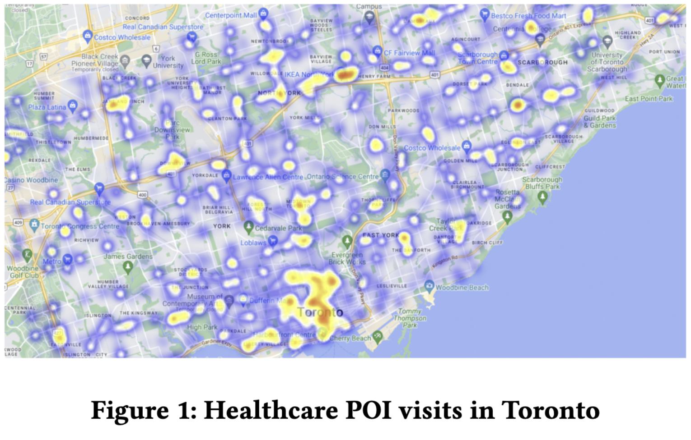
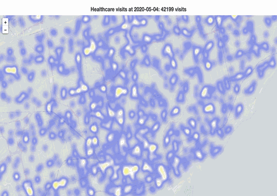
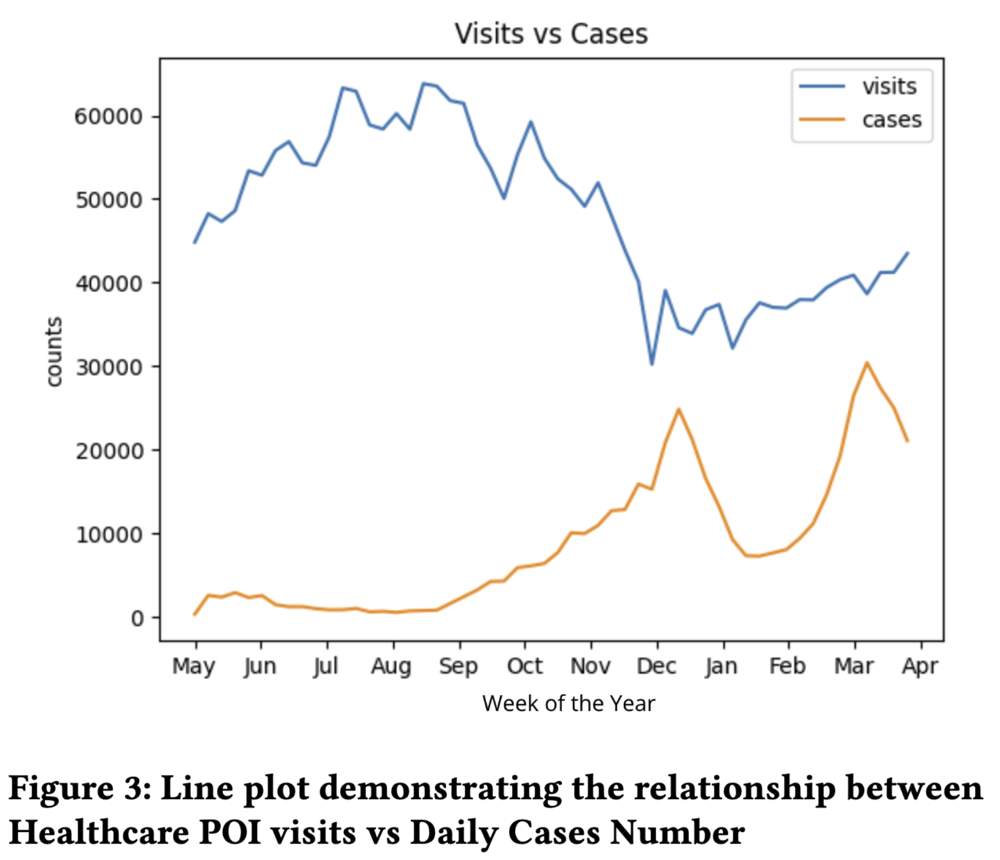
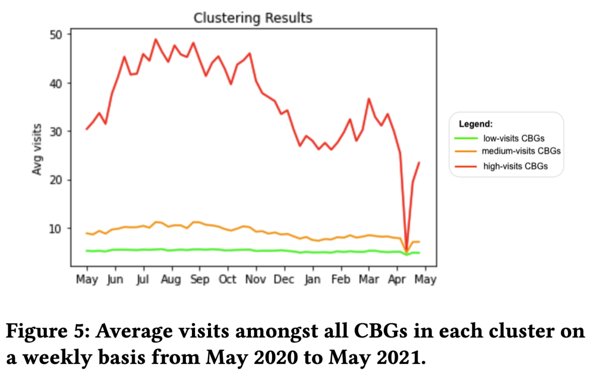
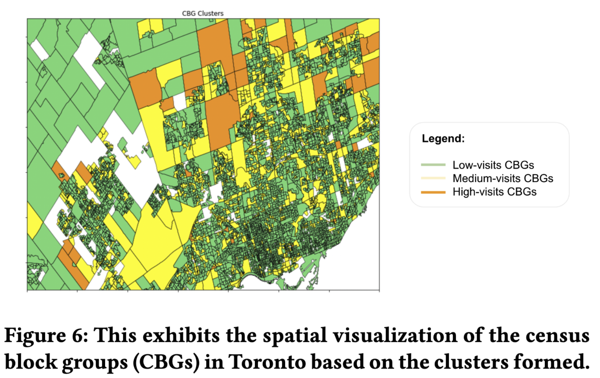
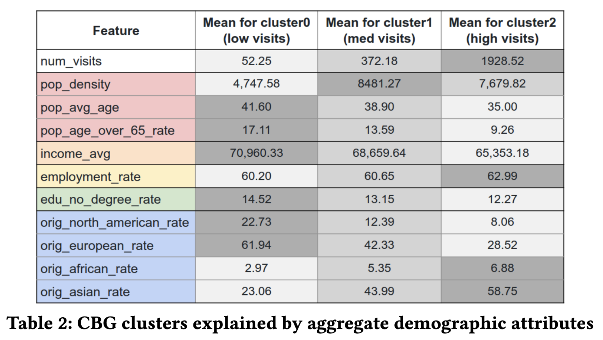

# Spatial and Temporal Analyses of Healthcare Visits Patterns during the COVID-19 Pandemic

This project explores the impact of the COVID-19 pandemic on healthcare visit patterns across the Greater Toronto Area (GTA). We utilized spatio-temporal data to analyze mobility and healthcare access during the pandemic, employing clustering techniques to identify patterns and correlations with socio-demographic characteristics.

## Project Goals
- **Assess** the effects of COVID-19 on healthcare facility utilization in the GTA.
- **Analyze** the correlation between healthcare visit patterns and socio-demographic characteristics.
- **Cluster** Census Block Groups (CBGs) based on visit patterns.
- **Visualize** the spatial and temporal distribution of healthcare visits.

## Methodology

### Data Sources
1. **SafeGraph Weekly Patterns**: Location-based data on POIs and visitor footprints.
2. **SafeGraph Core POIs**: Provides detailed information about healthcare POIs.
3. **SafeGraph Geometry**: Geographical footprints of POIs.
4. **Canadian CBG Data**: Spatial data of Census Block Groups.
5. **Canadian Census Profile 2016**: Socio-demographic data of Canadian residents.

### Analytical Steps
1. **Preprocessing**: We filtered SafeGraph data for healthcare-related POIs and combined it with visitor home CBG data.
2. **Visualization**: Heatmaps (static and animated) were created to depict healthcare visits across the GTA.
3. **Clustering**: Using the K-Means algorithm, CBGs were grouped based on their healthcare visit frequencies.
4. **Correlation Analysis**: Socio-demographic data was analyzed to explore patterns and insights within different CBG clusters.

### Tools and Techniques
- **Pandas** and **Matplotlib** for data manipulation and visualization.
- **K-Means Clustering** for grouping CBGs based on visit patterns.
- **Scrapy** for crawling demographic data.

## Key Results

### Static and Animated Heatmaps
- **Static Heatmap**: Displays aggregated healthcare POI visits over 54 weeks across the GTA, with higher intensity in Toronto's downtown core.
  
  <!--  -->
  

- **Animated Heatmap**: Showcases weekly changes in visit patterns throughout the pandemic.

  <!--  -->
  

### Healthcare Visit Patterns vs. COVID-19 Cases
- As COVID-19 cases rose between May 2020 and December 2020, healthcare visits decreased, demonstrating a negative correlation.
- After December 2020, healthcare visits stabilized, despite fluctuating case numbers, possibly due to behavioral adaptation to the pandemic.

  <!--  -->
  

### Clustering of CBGs
CBGs were grouped into three clusters:
- **Low-visit** (green), **Medium-visit** (yellow), and **High-visit** (red) CBGs. The clustering identified distinct trends in healthcare visits over time.
  
  <!--  -->
  

  <!--  -->
  

### Socio-Demographic Analysis
- **Younger populations** tended to visit healthcare facilities more frequently.
- **Low-income groups** had slightly higher visit rates, likely due to reliance on public healthcare services.
- **Higher employment rates** correlated with more frequent visits to healthcare POIs.

  <!--  -->
  

## Conclusion
The COVID-19 pandemic disproportionately affected healthcare accessibility in different areas of Toronto. High-visit CBGs experienced visit patterns closely tied to the pandemic’s evolution, while lower-visit CBGs were relatively stable. Socio-demographic factors, such as age and income, also played a significant role in determining healthcare access.

## Future Work
- Expand the scope to include more cities or provinces.
- Build predictive models for healthcare visits based on temporal data.
- Analyze additional demographic features to refine clustering.

<!-- **Authors:**
- Gian Alix ([gcalix@yorku.ca](mailto:gcalix@yorku.ca))  
- Jing Li ([jliellen@yorku.ca](mailto:jliellen@yorku.ca))  
- Saeed Abbasi ([saeedabc@yorku.ca](mailto:saeedabc@yorku.ca))   -->
